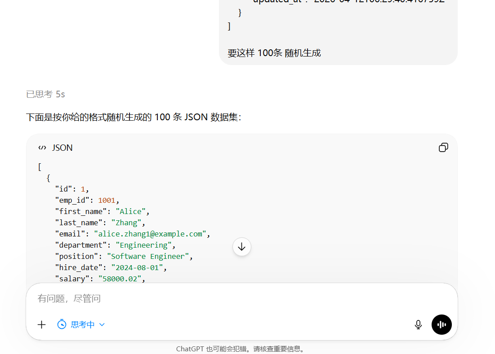

# Technical Report — XJCO3011 Web Services and Web Data

**Coursework 1:** Individual Web Services API Development Project  
**Project:** Employee Management Platform  
**Repository:** https://github.com/xiaochenchenc/XJCO3011_cw1  
**API document:** https://github.com/xiaochenchenc/XJCO3011_cw1/blob/main/cw1/API_document.pdf
**Link** https://caoyuchen688.pythonanywhere.com/

## Abstract

This project delivers a data-driven employee management system using Django, Django REST Framework (DRF), and SQLite. The system provides full CRUD operations, token-protected write actions, search and statistics endpoints, and a browser UI that consumes the same API. It is runnable locally and supported by automated tests. Key technical work includes resolving identifier ambiguity (`id`, `emp_id`, `export_id`), adding a stable JSON discovery endpoint, and implementing repeatable dataset import from `employees.json`.

## 1. Project goals and scope

### 1.1 Goals

1. Build a REST API over a single SQL-backed employee model.  
2. Return consistent JSON responses and HTTP status codes.  
3. Restrict create/update/delete operations to authenticated users.  
4. Provide a usable web interface for live demonstration.  
5. Submit runnable code with documentation and test evidence.

### 1.2 Scope

**In scope:** employee CRUD, search, department statistics, token authentication, local deployment, JSON import workflow.  
**Out of scope:** enterprise IAM, production hardening, and high-concurrency optimization.

## 2. Coursework requirement mapping

| Requirement | Evidence in this project |
|---|---|
| SQL-backed CRUD | `Employee` model + DRF `ModelViewSet` + SQLite |
| 4+ endpoints | `/api/employees/`, detail, `search`, `stats`, `auth`, `register`, `info` |
| JSON input/output | Serializer validation + JSON API responses |
| Status/error handling | 200/201/204/400/401/404 across implemented routes |
| Runnable system | `python manage.py runserver` + UI + browsable API |
| Testing evidence | `python manage.py test` with API and import coverage |
| GenAI declaration | Appendix A (declaration + screenshot + logs note) |

## 3. Technology choices

- **Python + Django:** fast implementation, ORM, migrations, admin, maintainable structure.  
- **Django REST Framework:** serializer-driven validation, router-based CRUD, token auth, browsable API.  
- **SQLite:** low setup overhead and deterministic local execution for coursework demos.  
- **HTML/CSS/JavaScript + Bootstrap:** lightweight UI without SPA build complexity.

These choices prioritize reliability and delivery speed while keeping a clear migration path to PostgreSQL and production-grade security controls later.

## 4. Architecture and routing

The system uses three layers:

1. **Presentation:** dashboard templates and static assets.  
2. **Application/API:** DRF viewset, serializers, auth handlers.  
3. **Data:** Django ORM + SQLite.

Key routes:

- `/` dashboard
- `/api/` DRF browsable root
- `/api/info/` machine-readable API index
- `/api/auth/`, `/api/auth/register/` authentication endpoints
- `/admin/` Django admin

`/api/info/` was added because `/api/` is human-friendly HTML, while scripts need a stable JSON discovery endpoint.

## 5. Data model and key design decisions

The `Employee` model includes:

- `id` (database primary key)
- `emp_id` (business identifier, unique)
- `export_id` (optional imported sequence id, unique when present)
- profile fields (`first_name`, `last_name`, `email`, `department`, `position`)
- optional `hire_date` and `salary`
- automatic timestamps

### Why `export_id` was introduced

`employees.json` contains its own row id. Django primary keys can differ across imports, so `export_id` preserves dataset order and lookup consistency in demos.

### Integrity controls
- Unique constraints on `emp_id` and `email`.
- Serializer validation for type/format checks.
- Nullable optional fields for practical imported data.

## 6. API implementation highlights

### 6.1 Core endpoints

- `GET/POST /api/employees/`
- `GET/PUT/PATCH/DELETE /api/employees/{pk}/`
- `GET /api/employees/search/?query=...`
- `GET /api/employees/stats/`

### 6.2 Detail lookup strategy

`{pk}` is resolved in this order:
1. database `id`  
2. `export_id`  
3. `emp_id`

This keeps DRF-compatible URLs while supporting business and imported identifiers.

### 6.3 Search and analytics

- Text search is case-insensitive across name/department/position/email.  
- Numeric queries also match `id`, `export_id`, and `emp_id`.  
- Stats endpoint returns employee counts grouped by department.

## 7. Authentication and security posture

Global policy is `IsAuthenticatedOrReadOnly`:

- read endpoints are public;
- write endpoints require token/session authentication.

Auth endpoints:

- `POST /api/auth/register/` creates user and returns token.
- `POST /api/auth/` returns token for valid credentials.

The UI aligns with this rule by storing token client-side, sending it on write requests, and disabling write actions until login.

Current limitations (development context): `DEBUG=True`, no throttling, and localStorage token handling.

## 8. Dataset import workflow (non-HTTP)

Bulk loading is intentionally implemented as a management command:

`python manage.py import_employees_json`

Key features:

- `--dry-run` for validation
- `--clear --yes` for controlled full reset
- JSON `id` mapped to `export_id`
- `update_or_create` by `emp_id` for idempotent re-imports

This keeps operational data-loading tasks outside the public HTTP API surface.

## 9. Testing and evidence

Automated tests cover:

- API info endpoint
- list and create employee flow
- text and numeric search
- detail lookup by `emp_id` and `export_id`
- import command smoke behavior

Manual checks were also performed for browser login/logout flow, write actions, and error feedback.

Known gaps: no browser E2E automation, no load testing, and limited concurrency testing.

## 10. Limitations and next steps
1. Add pagination for large list responses.  
2. Generate OpenAPI/Swagger docs.  
3. Add rate limiting on auth/write endpoints.  
4. Add role-based permissions and audit logs.  
5. Migrate from SQLite to PostgreSQL for stronger concurrency support.

## 11. Conclusion

The project satisfies XJCO3011 coursework expectations through a complete SQL-backed API and aligned web interface. It demonstrates full CRUD, authenticated writes, clear error semantics, practical analytics endpoints, and repeatable dataset import. The strongest engineering outcomes are consistent API behavior, explicit identifier strategy, and test-backed iteration.

\newpage

## Appendix A — Generative AI declaration and supplementary evidence

This coursework allows **declared** Generative AI usage. The following is the full declaration (moved here so the main report stays focused on engineering; markers can still verify compliance in one place).

**Declared usage:** ChatGPT was used **only** to generate the synthetic random dataset `employees.json` for demonstration and import testing.

No additional GenAI claim is made for application code, API design, or report prose beyond routine spelling checks (if any).

**Supplementary evidence (screenshot):** place `ChatGPT.png` in the same `docs/` folder as this report before exporting to PDF.

**Module requirement (conversation logs):** the XJCO3011 brief (Green assessment) expects **examples of exported conversation logs** alongside the declaration. Export the ChatGPT thread(s) used to produce `employees.json` (PDF or text) and submit **per Minerva / School instructions** (separate upload is acceptable). Include at least one excerpt showing the prompt and the model reply that led to the dataset.

## Appendix B — GitHub development and upload record

This appendix provides **evidence of version control and GitHub activity** (commits, pushes, or repository history) for the coursework repository.

*If the image does not render, confirm the file exists under `docs/` and the filename matches exactly.*

## Appendix C — Submission link checklist (from the coursework brief)

Your **Technical Report (PDF)** is expected to include working links (as required by Minerva). Fill these before final export:

| Item | Link |
|------|------|
| Public GitHub repository | `https://github.com/xiaochenchenc/XJCO3011_cw1` |
| API documentation (PDF) | https://github.com/xiaochenchenc/XJCO3011_cw1/blob/main/cw1/API_document.pdf
| Website | `https://caoyuchen688.pythonanywhere.com/` |

## Appendix D — Submission checklist (GenAI + evidence)

- [ ] **Appendix A** states **what** was generated (`employees.json`) and **which tool** (ChatGPT).  
- [ ] `docs/ChatGPT.png` is present for PDF embedding.  
- [ ] **Appendix B:** 
- [ ] No undeclared GenAI use for other parts of the submission (only declare what is true).
