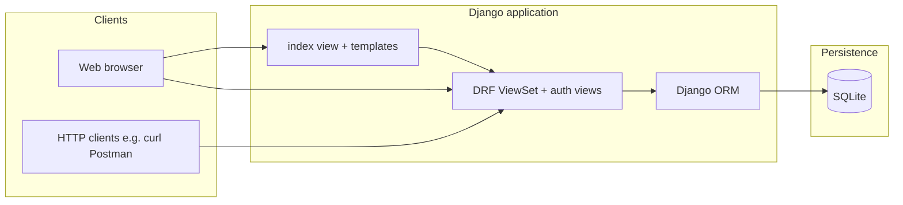

# Technical Report — XJCO3011 Web Services and Web Data

**Coursework 1:** Individual Web Services API Development Project  
**Project:** Employee Management Platform
**Repository:** https://github.com/xiaochenchenc/XJCO3011_cw1
**API document:** https://github.com/xiaochenchenc/XJCO3011_cw1/blob/main/cw1/docs/API_document.pdf

## Abstract

This report describes the design, implementation, and evaluation of a data-driven **employee management** system built for the XJCO3011 module. The solution combines a **Django** web application with **Django REST Framework (DRF)** for a JSON-first REST API backed by **SQLite**, a **Bootstrap**-based browser UI, and **token-based authentication** for write operations. The work satisfies the coursework minimum requirements (SQL-backed CRUD, multiple HTTP endpoints, conventional status codes, demonstrable local execution) and extends the baseline with search, department statistics, optional bulk import from `employees.json`, and explicit documentation of error handling and API discovery.

## 1. Introduction and objectives

### 1.1 Problem statement

Organisations need a consistent way to **store**, **query**, **update**, and **delete** employee records while exposing the same capabilities to programmatic clients (integration, scripting, coursework assessment) and human operators (browser UI).

### 1.2 Objectives

1. Implement a **RESTful** HTTP API over JSON for employee **CRUD**.  
2. Persist data in a **relational (SQL)** database with clear integrity rules.  
3. Enforce **authentication** for mutating operations while keeping reads accessible for demonstration.  
4. Provide **auxiliary** read endpoints (search, department counts) that demonstrate non-trivial querying.  
5. Ship **runnable** code, **tests**, and **documentation** suitable for oral examination and written submission.

### 1.3 Scope

**In scope:** Single-tenant employee directory, token auth, JSON API, simple web dashboard, local SQLite deployment, management-command import for seed data.  

**Out of scope (by design):** Production hardening (HTTPS, rate limiting, email verification), multi-tenant isolation, mobile native clients, external payroll integration.

## 2. Alignment with coursework requirements

| Requirement (brief) | How the project addresses it |
|----------------------|-------------------------------|
| CRUD on a data model linked to a SQL database | `Employee` model + DRF `ModelViewSet` + SQLite |
| At least four HTTP endpoints | Employees list/detail + `search` + `stats` + `auth` + `register` + `api/info/` |
| User input and JSON responses | POST/PATCH bodies validated via serializers; JSON responses throughout API |
| Conventional HTTP status / error codes | 200/201/204/400/401/404 used consistently (see API documentation) |
| Demonstrable locally | `python manage.py runserver`; automated tests under `python manage.py test` |
| Technology justification | Section 3 |
| GenAI declaration | Section 12 (dataset generation only) |

The module encourages public datasets; this project uses a **synthetic `employees.json`** bundle for reproducible demos (no external licensing ambiguity). That file was **generated using ChatGPT** as random demonstration data—see **§12** for the GenAI declaration. If real-world HR data were used, licence and privacy constraints would be documented here.

## 3. Technology stack and rationale

### 3.1 Python and Django

**Python** is used as the primary language for rapid development, strong ecosystem support for web and data access, and readability under examination.

**Django** was chosen over a minimal micro-framework (e.g. Flask) because:

- It provides a **mature ORM**, migrations, and admin infrastructure out of the box.  
- **DRF integrates cleanly** with Django models and permissions for API development.  
- The coursework timeline favours a **batteries-included** approach while still allowing customisation (custom token response, `get_object` logic, management commands).

**Alternatives considered:** **FastAPI** offers excellent async performance and automatic OpenAPI schemas; however, this project prioritised **familiar ORM workflows**, built-in **admin**, and **module lab alignment** with Django. **Node.js (Express)** would be equally viable but would trade Python ecosystem consistency for this submission.

### 3.2 Django REST Framework

DRF provides:

- **Serializers** for validation and representation of `Employee` instances.  
- **ViewSets** and **routers** for consistent URL patterns (`/api/employees/`, `/api/employees/{pk}/`).  
- **Token authentication** integration with minimal configuration.

### 3.3 SQLite

**SQLite** backs development because it requires no separate database server, simplifies coursework submission, and remains **fully SQL-compliant** for relational modelling. The ORM abstracts most dialect differences.

**Production path:** PostgreSQL or MySQL would replace SQLite for concurrency, richer locking, and operational tooling. Migration would be primarily configuration-driven (`DATABASES` + managed credentials).

### 3.4 Front end (HTML, CSS, JavaScript, Bootstrap)

The browser UI is intentionally **lightweight**: server-rendered `index.html`, **Bootstrap 5** for layout, and **vanilla JavaScript** with `fetch()` for API calls. This avoids a heavy SPA build pipeline while still demonstrating **asynchronous** interaction (list refresh, modal edit, token-aware writes).

## 4. System architecture

### 4.1 Logical architecture

The system follows a **classic three-tier** pattern:

1. **Presentation:** Browser UI + DRF browsable API (HTML where enabled).  
2. **Application:** Django views, DRF viewsets, serializers, authentication views.  
3. **Persistence:** SQLite file (`db.sqlite3`) via Django ORM.

### 4.2 URL routing

- **Page:** `/` → employee dashboard.  
- **API router:** `/api/` → DRF `DefaultRouter` (browsable **Api Root**).  
- **Stable JSON index:** `GET /api/info/` → custom `JsonResponse` listing key endpoints (avoids confusing the DRF HTML root with a machine-readable contract).  
- **Auth:** `POST /api/auth/`, `POST /api/auth/register/`.  
- **Admin:** `/admin/` for staff data maintenance.

## 5. Data model and integrity

### 5.1 Employee entity

The `Employee` model is the single domain aggregate for this coursework. Fields:

| Field | Role |
|-------|------|
| `id` | Surrogate primary key (Django auto). |
| `export_id` | Optional **stable sequence** from `employees.json` key `"id"`; supports list ordering and detail lookup; **unique** when set. |
| `emp_id` | Business employee number; **unique**. |
| `first_name`, `last_name` | Personal identification. |
| `email` | **Unique**; used for login-independent identity in imports. |
| `department`, `position` | Organisational attributes (blank allowed). |
| `hire_date`, `salary` | Nullable for incomplete records. |
| `created_at`, `updated_at` | Automatic timestamps (`auto_now_add` / `auto_now`). |

### 5.2 Design rationale for `export_id`

JSON exports often contain a stable **`id`** field that is **not** the same as Django’s auto-increment `id` after repeated imports. Storing that value as `export_id`:

- Preserves **ordering** consistent with the seed file (`Coalesce(export_id, large sentinel)` then `emp_id`).  
- Allows **detail resolution** in `GET /api/employees/{pk}/` after `pk` match on database `id` and before `emp_id`, reducing confusion during demos.

`export_id` is **read-only via the public serializer**; it is populated by the **`import_employees_json`** management command, not by arbitrary API clients, to prevent inconsistent numbering.

### 5.3 Constraints and validation

Uniqueness on `emp_id` and `email` is enforced at the database level. DRF performs additional validation (e.g. email format). Optional fields allow partial real-world data without blocking imports.

## 6. REST API design

### 6.1 Resource layout

The `EmployeeViewSet` exposes standard **ModelViewSet** routes under `/api/employees/`:

| Method | Path | Purpose |
|--------|------|---------|
| GET | `/api/employees/` | List employees (ordered as per §5.2). |
| POST | `/api/employees/` | Create employee (**auth required**). |
| GET | `/api/employees/{pk}/` | Retrieve one employee. |
| PUT / PATCH | `/api/employees/{pk}/` | Replace / partial update (**auth required**). |
| DELETE | `/api/employees/{pk}/` | Delete (**auth required**). |

Custom `@action` endpoints:

| Method | Path | Purpose |
|--------|------|---------|
| GET | `/api/employees/search/?query=...` | Text search + numeric matching (see below). |
| GET | `/api/employees/stats/` | `Count` grouped by `department`. |

### 6.2 Detail lookup semantics (`{pk}`)

The URL kwarg remains `{pk}` for DRF compatibility, but **`get_object` overrides** resolution:

1. Integer match on **database primary key** `id`.  
2. Else integer match on **`export_id`**.  
3. Else integer match on **`emp_id`**.

Non-integer path segments yield **404**. This design balances **tooling expectations** (hyperlinks often use `id`) with **business identifiers** (`emp_id`) and **seed ordering** (`export_id`).

### 6.3 Search behaviour

Search applies **case-insensitive** substring filters across name, department, position, and email. If the query is **digits-only**, results also include rows where **`emp_id`**, **`id`**, or **`export_id`** equals that integer—useful for quick lookup during demos.

### 6.4 Statistics endpoint

`stats` aggregates **all** employees by `department` using Django’s aggregation API. This is intentionally independent of the annotated ordering queryset used for listing, so counts remain globally accurate.

## 7. Authentication and authorisation

### 7.1 Global policy

`REST_FRAMEWORK['DEFAULT_PERMISSION_CLASSES']` is set to **`IsAuthenticatedOrReadOnly`**. Therefore:

- **Safe methods** (GET, HEAD, OPTIONS) on employee endpoints are **public**.  
- **Unsafe methods** (POST, PUT, PATCH, DELETE) require **`Token`** (or **Session** authentication if the same browser is logged into the site).

### 7.2 Registration and login

- **`POST /api/auth/register/`** creates a `User`, hashes the password with Django’s default hasher, issues a **Token**, and returns user metadata. Custom **`{ "error": "..." }`** responses distinguish simple business-rule failures (duplicate username/email, missing fields).  
- **`POST /api/auth/`** subclasses DRF’s **`ObtainAuthToken`** to return token plus basic user profile fields.

### 7.3 Web UI integration

The dashboard stores the token in **`localStorage`** and attaches **`Authorization: Token ...`** to mutating `fetch` calls. Write actions are disabled until login to avoid silent **401** failures.

### 7.4 Security limitations (honest assessment)

- **Development settings** use `DEBUG = True` and a fixed `SECRET_KEY` in source control—acceptable for coursework, **not** for production.  
- Tokens in **localStorage** are vulnerable to **XSS** if untrusted scripts were injected; a stricter deployment would use **httpOnly cookies** + CSRF strategy or short-lived JWT with refresh rotation.  
- **No rate limiting** is configured; brute-force login would be mitigated in production (throttling, CAPTCHA, lockout).

## 8. Bulk data import (non-HTTP)

Bulk loading is implemented as **`python manage.py import_employees_json`**, not as a REST endpoint. Reasons:

- Keeps the **HTTP API surface** focused on CRUD and read analytics.  
- Avoids exposing a destructive “import” URL without strong operational controls.  
- Aligns with typical **Django operational** practice (management commands for migrations of data).

The command supports **`--dry-run`**, optional **`--clear --yes`** (full table wipe before reload), maps JSON **`id` → `export_id`**, and uses **`update_or_create`** keyed by **`emp_id`** for idempotent re-imports.

## 9. Error handling and HTTP semantics

The API relies on **meaningful status codes** and structured JSON bodies (see `docs/API_DOCUMENTATION.md`, section *Error handling*):

- **400** for validation failures (serializer field errors, missing `query` on search, bad register payloads).  
- **401** for unauthenticated writes.  
- **404** for unknown employees or invalid integer detail keys.  
- **204** for successful DELETE without a body.

This matches industry conventions expected in the module rubric and simplifies client implementations.

## 10. Testing strategy

### 10.1 Automated tests

Tests live in **`webapp/tests.py`** and use **`APITestCase`** with token credentials. They cover:

- JSON index **`GET /api/info/`**.  
- Listing and **creating** employees with authentication.  
- **Search** by name and by **numeric** `emp_id`.  
- **Detail** retrieval when the URL segment matches **`emp_id`** or **`export_id`** rather than primary key.  
- **`import_employees_json`** smoke behaviour (temporary JSON file; verifies `export_id` persistence and independence from JSON’s legacy `id` as Django PK).

### 10.2 Gaps and future test work

- No automated **browser (E2E)** tests (Playwright/Selenium)—manual UI verification only.  
- **Pagination** is not implemented; list tests assume modest dataset sizes.  
- **Concurrent update** races are not exercised (SQLite locking differs from production DBs).

## 11. Challenges, trade-offs, and lessons learned

1. **Primary key vs business keys:** Early confusion between Django **`id`** and JSON **`id`** / **`emp_id`** led to explicit **`export_id`** and documented lookup order—a lesson in **naming** and **API contracts**.  
2. **Read-only public writes:** Allowing anonymous reads simplified demos but required careful **UI** alignment so users log in before POST/PUT/DELETE.  
3. **DRF router root vs JSON:** The default **`GET /api/`** HTML root is useful for exploration but poor for scripting; adding **`/api/info/`** resolved discoverability without fighting the router.  
4. **Import idempotency:** Using **`update_or_create`** on `emp_id` prevents duplicate rows when re-running imports during development.

## 12. Generative AI (GenAI) declaration

The module classifies this coursework as a **Green** assessment for Generative AI: tools may be used where declared, with appropriate reflection and (where required) exported conversation logs attached as supplementary material.

**Declaration (sole use reported here):** **ChatGPT** was used to **produce the synthetic random dataset** bundled as `employees.json` (realistic-looking employee names, emails, departments, salaries, hire dates, and related fields for demonstration and import testing). No other GenAI-assisted activities are claimed in this section of the report.

The application code, API design, database schema beyond consuming that file, tests, and written documentation were implemented separately; the only Generative AI contribution declared here is **dataset generation** via ChatGPT.

**Supplementary material:** [Insert link or appendix reference to the exported ChatGPT conversation used to generate `employees.json`, as required by your Minerva submission checklist.]

## 13. Limitations and future improvements

**Near-term engineering**

- **Pagination** (`PageNumberPagination` or cursor) for large employee tables.  
- **OpenAPI / Swagger** schema generation (`drf-spectacular`) for interactive docs.  
- **Throttling** on login and write endpoints.  
- **Password reset** and email verification flows.

**Architecture / product**

- **Role-based access control** (e.g. HR vs read-only analyst).  
- **PostgreSQL** migration + environment-based secrets.  
- **Audit trail** for who changed which employee field.  
- **CSV export** and scheduled backups.

## 14. Conclusion

The delivered system meets the **functional** and **documentation** expectations of XJCO3011 Coursework 1: a SQL-backed employee resource with full **CRUD**, auxiliary read endpoints, token-secured writes, conventional HTTP error handling, automated tests, and clear separation between **HTTP API** behaviour and **offline** bulk import. The main trade-off is **development-grade** security and scalability in exchange for **clarity** and **speed of demonstration**—both acknowledged and mitigated in §7.4 and §13.

## 15. References

1. Django Software Foundation. *Django documentation* (version 5.2). https://docs.djangoproject.com/en/5.2/  
2. Django REST Framework. *API Guide*. https://www.django-rest-framework.org/  
3. Bootstrap. *Bootstrap 5 documentation*. https://getbootstrap.com/docs/5.3/getting-started/introduction/  
4. University of Leeds. *XJCO3011 Coursework 1 Assessment Brief* (module materials / Minerva).  
5. Fielding, R. T. *Architectural Styles and the Design of Network-based Software Architectures* (REST dissertation). https://www.ics.uci.edu/~fielding/pubs/dissertation/top.htm  

